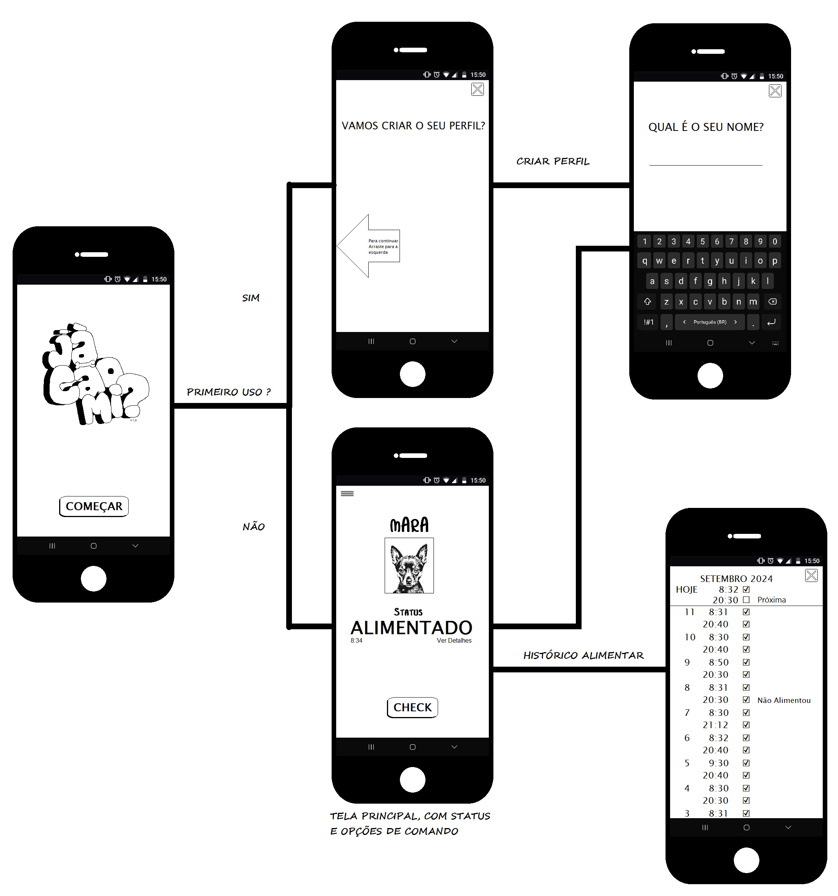

# Projeto de Interface

O projeto da interface da aplicação tem como objetivos principais, uma apresentação simples e com limitação sobre a quantidade de informação apresentada em cada tela, a fim de que se evite a confusão e a estafa ocular, ícones e padrões de fácil dedução sobre o uso da ferramenta, dentre outros, agilidade, acessibilidade e usabilidade são a tríade indispensável à implementação.

## Diagrama de Fluxo

O diagrama da figura 1.1, faz uma breve apresentação das principais vias de uso da aplicação, e as principais escolhas. Cada uma destas telas serão melhor detalhadas nos próximos tópicos.

-->IMAGE GOES HERE<--

As referências abaixo irão auxiliá-lo na geração do artefato “Diagramas de Fluxo”.

> **Links Úteis**:
> - [Fluxograma online: seis sites para fazer gráfico sem instalar nada | Produtividade | TechTudo](https://www.techtudo.com.br/listas/2019/03/fluxograma-online-seis-sites-para-fazer-grafico-sem-instalar-nada.ghtml)

## Wireframes

São protótipos usados em design de interface para sugerir a estrutura de um site web e seu relacionamentos entre suas páginas. Um wireframe web é uma ilustração semelhante do layout de elementos fundamentais na interface.
 
> **Links Úteis**:
> - [Protótipos vs Wireframes](https://www.nngroup.com/videos/prototypes-vs-wireframes-ux-projects/)
> - [Ferramentas de Wireframes](https://rockcontent.com/blog/wireframes/)
> - [MarvelApp](https://marvelapp.com/developers/documentation/tutorials/)
> - [Figma](https://www.figma.com/)
> - [Adobe XD](https://www.adobe.com/br/products/xd.html#scroll)
> - [Axure](https://www.axure.com/edu) (Licença Educacional)
> - [InvisionApp](https://www.invisionapp.com/) (Licença Educacional)
