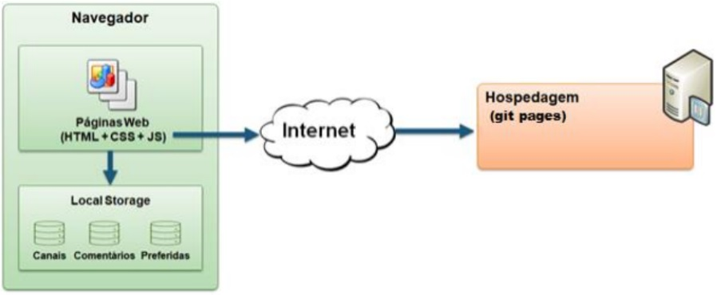

# Arquitetura da Solução

Nesta seção são apresentados os detalhes técnicos da solução criada pela equipe, tratando da Arquitetura da Solução, as estruturas de dados e as telas já implementadas.

## Diagrama de Componentes

Os componentes que fazem parte da solução são apresentados na Figura que se segue.

A solução implementada conta com os seguintes módulos:
* Tela inicial: Interface básica do sistema
* Páginas Web: Conjunto de arquivos HTML, CSS, JavaScript e imagens que implementam as funcionalidades do sistema.
* Local Storage: Armazenamento mantido no Navegador, onde são implementados bancos de dados baseados em JSON. São eles:
* Criar Lembrete: Seção para programar os horários de alimentação.
* Cadastro: Seção para cadastrar um ou mais cães.
* Histórico: Registro de alimentação.
* Conectar Dispositivos: Seção para compartilhar com outros usuários o status e a tarefa de alimentação.

## Diagrama de Classes

O diagrama de classes é um diagrama estrutural e define uma estrutura estática de relacionamento entre as classes. Seguem as principais classes desenvolvidas neste projeto.

## Modelo ER

O Modelo ER representa através de um diagrama como as entidades (coisas, objetos) se relacionam entre si na aplicação interativa.]

As referências abaixo irão auxiliá-lo na geração do artefato “Modelo ER”.

> - [Como fazer um diagrama entidade relacionamento | Lucidchart](https://www.lucidchart.com/pages/pt/como-fazer-um-diagrama-entidade-relacionamento)

## Esquema Relacional

O Esquema Relacional corresponde à representação dos dados em tabelas juntamente com as restrições de integridade e chave primária.
 
As referências abaixo irão auxiliá-lo na geração do artefato “Esquema Relacional”.

> - [Criando um modelo relacional - Documentação da IBM](https://www.ibm.com/docs/pt-br/cognos-analytics/10.2.2?topic=designer-creating-relational-model)

## Modelo Físico (DDL)

Entregar um arquivo banco.sql contendo os scripts de criação das tabelas do banco de dados. Este arquivo deverá ser incluído dentro da pasta src\bd.

## Instruções SQL de Manipulação do BD (DML)

Entregar um arquivo dml.sql contendo os scripts de manipulação de banco de dados. Este arquivo deverá ser incluído dentro da pasta src\bd.

## Tecnologias Utilizadas

Descreva aqui qual(is) tecnologias você vai usar para resolver o seu problema, ou seja, implementar a sua solução. Liste todas as tecnologias envolvidas, linguagens a serem utilizadas, serviços web, frameworks, bibliotecas, IDEs de desenvolvimento, e ferramentas.

Apresente também uma figura explicando como as tecnologias estão relacionadas ou como uma interação do usuário com o sistema vai ser conduzida, por onde ela passa até retornar uma resposta ao usuário.

## Hospedagem

O site utilizará a plataforma git pages como ambiente de hospedagem do site do projeto. O site é mantido no ambiente da URL:
https://glauberlanna.github.io/ProjetoEixoIII/index.html
A publicação do site no git pages é feita por meio de uma submissão do projeto (push) via git para o repositório remoto que se encontra no endereço:
https://github.com/glauberlanna/ProjetoEixoIII.git
